<div align="center">

# PQC Audit Ledger

### Post-quantum signed, tamper-evident audit receipts for agentic payments.

**Every intent, authority check, policy decision, authorization, payment attempt, gateway state, and refusal becomes independently verifiable evidence.**

[](https://www.typescriptlang.org/)
[](#cryptographic-suite)
[](#cryptographic-suite)
[](#canonicalization)
[](#tests)
[](#data)
[](#threat-model)

</div>

> **Core principle:** a signed receipt proves what was signed. It does not prove that the underlying decision was correct.

---

## Two-Line Description

**PQC Audit Ledger creates post-quantum signed, tamper-evident receipts for every critical step in an agentic payment flow.**
**Anyone can download the audit bundle and independently verify the signatures, hash chain, and Merkle proofs offline — without trusting the issuing system.**

---

## Why This Exists

AI agents are increasingly capable of taking actions that move money.

That creates a different problem from ordinary application logging.

A traditional log can say:

```text
payment approved
```

A cryptographically verifiable audit record can establish:

```text
what happened
+
what exact bytes were recorded
+
who signed them
+
where they sat in the sequence
+
whether they were included in the published batch
```

This project explores the **last mile of trust** for agentic payments:

> **Can an external party verify what happened without trusting the system that produced the record?**

The answer here is designed around three layers:

```text
CRYPTOGRAPHIC INTEGRITY
        +
CHAIN INTEGRITY
        +
BATCH INCLUSION
```

using:

* **ML-DSA-65 / FIPS 204** signatures
* **SHA-256** payload hashing
* **JCS-style canonicalization**
* **hash-chained receipts**
* **Merkle-tree anchoring**
* **offline verification**

---

# Architecture

The entire system is represented by one end-to-end architecture:

```mermaid
flowchart LR

    %% =========================================================
    %% AGENT + INTENT
    %% =========================================================

    subgraph AGENT["01 · AGENT / USER INTENT"]
        USER["USER INSTRUCTION<br/><br/>Natural-language intent"]
        PARSER["AGENT / INTENT PARSER<br/><br/>Extracts requested action<br/>Validates structured intent"]
        USER --> PARSER
    end

    %% =========================================================
    %% AUTHORITY
    %% =========================================================

    subgraph AUTH["02 · AUTHORITY + POLICY"]
        AUTHORITY["SPEND AUTHORITY<br/><br/>Merchant / agent grant<br/>Spend limits<br/>Authority status"]

        POLICY["DETERMINISTIC POLICY<br/><br/>Intent constraints<br/>Spend authority<br/>Policy rules<br/><br/><b>Agent cannot bypass this layer</b>"]

        PARSER --> AUTHORITY
        AUTHORITY --> POLICY
    end

    %% =========================================================
    %% PAYMENT CONTROL
    %% =========================================================

    subgraph CONTROL["03 · PAYMENT CONTROL PLANE"]
        PROPOSE["PAYMENT PROPOSAL<br/><br/>Amount<br/>Merchant<br/>Order<br/>Payment intent"]

        DECISION{"POLICY VERDICT"}

        AUTHORIZE["AUTHORIZE"]

        REFUSE["REFUSE"]

        POLICY --> PROPOSE
        PROPOSE --> DECISION
        DECISION -->|Allowed| AUTHORIZE
        DECISION -->|Denied| REFUSE
    end

    %% =========================================================
    %% GATEWAY
    %% =========================================================

    subgraph GATEWAY["04 · PAYMENT EXECUTION"]
        ATTEMPT["PAYMENT ATTEMPT<br/><br/>Adapter boundary"]

        SIM["PAYMENT SIMULATOR<br/><br/>Only implementation in repository<br/>No live money reachable"]

        STATE["GATEWAY STATE READ-BACK<br/><br/>Success / failure<br/>Transaction state"]

        AUTHORIZE --> ATTEMPT
        ATTEMPT --> SIM
        SIM --> STATE
    end

    %% =========================================================
    %% RECEIPT GENERATION
    %% =========================================================

    subgraph RECEIPTS["05 · CRYPTOGRAPHIC RECEIPT"]
        BODY["CANONICAL RECEIPT BODY<br/><br/>Intent<br/>Authority<br/>Policy verdict<br/>Authorization<br/>Attempt<br/>Gateway state<br/>References<br/>Previous hash<br/>Signing key ID"]

        HASH["SHA-256<br/><br/>Canonical payload hash"]

        SIGN["ML-DSA-65 SIGNATURE<br/><br/>FIPS 204<br/>NIST Category 3"]

        RECEIPT["SIGNED RECEIPT<br/><br/>Payload + hash + signature<br/>Key identity + sequence"]

        BODY --> HASH
        HASH --> SIGN
        SIGN --> RECEIPT
    end

    %% =========================================================
    %% CHAIN
    %% =========================================================

    subgraph CHAIN["06 · APPEND-ONLY LEDGER"]
        PREV["PREVIOUS RECEIPT HASH"]

        APPEND["APPEND-ONLY RECEIPT STORE<br/><br/>Database trigger rejects<br/>updates and deletes"]

        SEQ["SEQUENTIAL CHAIN<br/><br/>Receipt N<br/>↓<br/>Receipt N+1<br/>↓<br/>Receipt N+2"]

        RECEIPT --> PREV
        PREV --> APPEND
        APPEND --> SEQ
    end

    %% =========================================================
    %% MERKLE
    %% =========================================================

    subgraph MERKLE["07 · BATCH ANCHORING"]
        LEAVES["MERKLE LEAVES<br/><br/>SHA-256(0x00 || payloadHash)"]

        TREE["MERKLE TREE<br/><br/>SHA-256(0x01 || left || right)<br/>RFC 6962 domain separation<br/>Odd nodes promoted"]

        ROOT["BATCH ROOT<br/><br/>Single commitment to<br/>the receipt set"]

        SEQ --> LEAVES
        LEAVES --> TREE
        TREE --> ROOT
    end

    %% =========================================================
    %% VERIFIER
    %% =========================================================

    subgraph VERIFY["08 · INDEPENDENT VERIFICATION"]
        BUNDLE["DOWNLOADABLE AUDIT BUNDLE<br/><br/>Receipts<br/>Public key<br/>Merkle root<br/>Proof data"]

        OFFLINE["SINGLE-FILE OFFLINE VERIFIER<br/><br/>No network<br/>No install<br/>Independent execution"]

        CANON["1 · RE-CANONICALIZE<br/><br/>Rebuild exact bytes"]

        HASHCHECK["2 · RECOMPUTE SHA-256<br/><br/>Detect body changes"]

        SIGCHECK["3 · VERIFY ML-DSA-65<br/><br/>Verify signer + bytes"]

        CHAINCHECK["4 · VERIFY CHAIN<br/><br/>Sequence + previous hash"]

        MERKLECHECK["5 · VERIFY MERKLE PROOF<br/><br/>Receipt inclusion"]

        RESULT{"VERIFICATION RESULT"}

        BUNDLE --> OFFLINE
        OFFLINE --> CANON
        CANON --> HASHCHECK
        HASHCHECK --> SIGCHECK
        SIGCHECK --> CHAINCHECK
        CHAINCHECK --> MERKLECHECK
        MERKLECHECK --> RESULT
    end

    ROOT --> BUNDLE
    RECEIPT --> BUNDLE

    %% =========================================================
    %% FAILURE PATHS
    %% =========================================================

    REFUSE --> REFUSAL["SIGNED REFUSAL RECEIPT"]
    REFUSAL --> BODY

    SIM --> FAILURE["PAYMENT FAILURE<br/><br/>Failure itself becomes evidence"]
    FAILURE --> BODY

    STATE --> BODY

    %% =========================================================
    %% SECURITY BOUNDARIES
    %% =========================================================

    KEY["DEVELOPMENT SIGNING KEY<br/><br/>Deterministically derived from environment seed<br/><b>NOT production-safe</b>"]

    KEY -.-> SIGN

    %% =========================================================
    %% OUTPUTS
    %% =========================================================

    RESULT --> VALID["EXIT 0<br/><br/>Every receipt verified<br/>Chain intact"]

    RESULT --> INVALID["EXIT 1<br/><br/>Names receipt<br/>and failed check"]

    %% =========================================================
    %% STYLING
    %% =========================================================

    classDef agent fill:#151a21,stroke:#68727e,color:#f4f0e8,stroke-width:1.5px
    classDef control fill:#191b20,stroke:#c59a45,color:#f4f0e8,stroke-width:2px
    classDef crypto fill:#211a27,stroke:#9875ad,color:#f4f0e8,stroke-width:2px
    classDef ledger fill:#171c22,stroke:#c59a45,color:#f4f0e8,stroke-width:2px
    classDef merkle fill:#15231f,stroke:#4d9677,color:#f4f0e8,stroke-width:2px
    classDef verify fill:#111d24,stroke:#4f91ad,color:#f4f0e8,stroke-width:2px
    classDef danger fill:#26191b,stroke:#a55c60,color:#f4f0e8,stroke-width:2px
    classDef warning fill:#241f17,stroke:#a8874d,color:#f4f0e8,stroke-width:2px
    classDef result fill:#15231f,stroke:#4d9677,color:#f4f0e8,stroke-width:2px

    class USER,PARSER agent
    class AUTHORITY,POLICY,PROPOSE,DECISION,AUTHORIZE control
    class BODY,HASH,SIGN,RECEIPT crypto
    class PREV,APPEND,SEQ ledger
    class LEAVES,TREE,ROOT merkle
    class BUNDLE,OFFLINE,CANON,HASHCHECK,SIGCHECK,CHAINCHECK,MERKLECHECK,RESULT verify
    class REFUSE,REFUSAL,FAILURE,INVALID danger
    class KEY,ATTEMPT warning
    class VALID result
```



### Architecture in one line

```text
Agent intent
    ↓
Authority check
    ↓
Deterministic policy
    ↓
Authorize / Refuse
    ↓
Payment attempt
    ↓
Gateway state
    ↓
Canonical receipt
    ↓
SHA-256
    ↓
ML-DSA-65 signature
    ↓
Hash chain
    ↓
Merkle batch root
    ↓
Offline third-party verification
```

The crucial property is that **success and refusal both become cryptographically verifiable events**.

---

# What Is Actually Proven?

A valid signature proves:

* the exact bytes were signed by the holder of the private key
* those bytes have not changed
* the receipt identifies the signing key
* the receipt occupies its recorded position in the chain
* the receipt was included in the published batch root

A valid signature does **not** prove:

* the merchant was legitimate
* the buyer wanted the purchase
* the policy was sensible
* the agent understood the instruction
* the payment was a good idea

Therefore:

> **A signed bad decision is still a reliably recorded bad decision.**

Integrity is not judgement.

This project claims the former, not the latter.

---

# Cryptographic Suite

| Component        | Implementation                       |
| ---------------- | ------------------------------------ |
| Signature        | **ML-DSA-65**                        |
| Standard         | **FIPS 204**                         |
| Security level   | NIST Category 3                      |
| Implementation   | `@noble/post-quantum` 0.7.1          |
| Public key       | 1,952 bytes                          |
| Private key      | 4,032 bytes                          |
| Signature        | 3,309 bytes                          |
| Hash             | SHA-256                              |
| Canonicalization | JCS / RFC 8785 subset                |
| Merkle tree      | SHA-256 + RFC 6962 domain separation |

No cryptographic primitive is implemented manually in this repository.

The implementation uses `@noble/post-quantum` rather than a native `liboqs` addon because the deployment target requires the cryptographic implementation to run identically in local development, tests, and the deployed serverless environment.

---

# Canonicalization

Canonicalization is critical because the signature is over **bytes**, not an abstract JSON object.

The rules are:

1. Object keys are sorted by UTF-16 code unit, ascending.
2. Insignificant whitespace is removed.
3. Array ordering is preserved.
4. `null` is serialized.
5. `undefined` is rejected.
6. Non-finite numbers are rejected.
7. Integers outside the exact-integer range are rejected.
8. Standard JSON string escaping is used.
9. Output is UTF-8.
10. Nothing downstream re-encodes the canonical bytes.

The purpose is simple:

> **The signer and verifier must produce exactly the same bytes.**

---

# Merkle Tree

Merkle anchoring provides a second level of integrity over the receipt set.

## Leaf

```text
SHA-256(
    0x00 || receiptPayloadHash
)
```

The leaf commits to the payload hash rather than the receipt ID.

## Internal node

```text
SHA-256(
    0x01 || left || right
)
```

The domain prefixes separate leaves from internal nodes.

## Ordering

Leaves are ordered by ledger sequence.

They are **not sorted**.

## Odd nodes

An odd node is promoted unchanged to the next level.

It is not duplicated.

## Empty tree

An empty tree is rejected.

There is no meaningful batch commitment containing zero receipts.

---

# What the Signature Covers

The signed receipt body includes:

* schema version
* receipt ID
* event type and version
* timestamp
* complete event object
* agent reference
* authority reference
* policy reference
* action reference
* intent reference
* tool-call reference
* merchant reference
* order reference
* payment reference
* previous receipt hash
* signing key ID

The **signing key ID itself is inside the signed body**.

This prevents an attacker from taking a valid receipt and externally re-pointing it at another key.

---

# What the Signature Does Not Cover

The Merkle batch, root, and proof are **not** signed into the individual receipt.

They cannot be.

The receipt exists before the batch is constructed.

Instead:

```text
Receipt
   │
   ▼
Payload hash
   │
   ▼
Signature

Later:

Receipt hashes
   │
   ▼
Merkle tree
   │
   ▼
Merkle root
```

These are separate cryptographic statements:

> **Signature:** these exact bytes were signed by this key.

> **Merkle root:** this payload was included in this committed batch.

Conflating those two statements would overstate what the cryptography proves.

---

# Append-Only Ledger

The database uses an append-only trigger.

Application-level updates and deletes are rejected.

The receipt sequence forms a linked chain:

```text
Receipt N
   │
   ├── payload
   ├── payloadHash
   ├── signature
   └── previousHash
             │
             ▼
        Receipt N+1
             │
             ▼
        Receipt N+2
```

This provides protection against:

* accidental modification
* ORM mistakes
* ordinary application-level deletion
* ordinary application-level updates

A database superuser can still bypass the trigger.

That is why the system also has cryptographic verification.

---

# Offline Verification

The final trust boundary is deliberately outside the application.

Download:

```bash
curl -O https://<host>/api/bundle
curl -O https://<host>/ledger-verify.mjs
```

Then run:

```bash
node ledger-verify.mjs audit-bundle.json
```

The verifier performs:

```text
1. Canonicalize receipt
        ↓
2. Recompute SHA-256
        ↓
3. Verify ML-DSA-65 signature
        ↓
4. Verify previous-hash chain
        ↓
5. Verify Merkle inclusion
        ↓
6. Return verification result
```

No network is required.

No package installation is required.

The verifier is designed to make the evidence independently inspectable.

---

# Verification Results

```text
EXIT 0
```

means every checked receipt verified and the chain is intact.

```text
EXIT 1
```

identifies the receipt and the verification check that failed.

The important distinction is:

> **The verifier does not ask the application whether the receipt is valid.**

It recomputes the evidence itself.

---

# Results

From the bundled development corpus:

**30 agent actions · ~190 receipts**

| Measurement            |                                               Result |
| ---------------------- | ---------------------------------------------------: |
| Tamper detection       |              **1.000** over ~1,430 applied mutations |
| False verification     |               **0.000** over ~190 untouched controls |
| Audit completeness     | **1.000** of agent actions have a full receipt chain |
| Column/body divergence |                        **0** of ~1,350 probed values |
| Chain                  |                                           **Intact** |
| Sign latency           |         p50 ≈ 6.7 ms · p95 ≈ 17.7 ms · p99 ≈ 27.7 ms |
| Verify latency         |           p50 ≈ 1.8 ms · p95 ≈ 1.9 ms · p99 ≈ 2.2 ms |

---

# Reading These Results Honestly

## 1.000 tamper detection is a regression test

Any mutation to the canonical bytes should change their SHA-256.

Therefore:

```text
tamper detection = 1.000
```

is not evidence that ML-DSA is "strong."

A failure would instead indicate a defect in the canonicalization or verification pipeline.

---

## False verification is the more interesting metric

The false-verification test checks whether an altered or inconsistently serialized receipt could still pass verification.

That is the failure mode that could reveal a canonicalization problem.

---

## Excluded mutations are visible

Approximately **1,079 mutations could not be applied** because the target field did not exist in the selected receipt.

Those are excluded rather than counted as successful tamper tests.

The evaluation keeps:

```text
attempted
applied
detected
```

separate so the denominator cannot quietly be manipulated.

---

## Denormalized columns are checked separately

The ledger stores values such as:

* event type
* action ID
* agent ID
* occurred-at

outside the JSON body for queryability.

Because the signature covers the body, not independently stored database columns, the evaluator compares those columns against the signed body directly.

That test catches divergence that the payload hash alone would not express.

---

## Merkle verification is sampled

Merkle proofs are verified on a sample of 25 receipts rather than rebuilding the tree independently for every receipt.

The sample size is exposed in the evaluation output.

---

## Signature bytes are not reproducible

FIPS 204 signing is hedged.

Signing identical bytes again can produce a different signature that still verifies.

Therefore:

```text
payload hash → reproducible
Merkle root   → reproducible
signature     → not byte-for-byte reproducible
```

The system does not treat a signature as an identity.

---

# Threat Model

| Adversary                | Capability                          | Defense / Reality                                         |
| ------------------------ | ----------------------------------- | --------------------------------------------------------- |
| Compromised agent        | Can propose arbitrary actions       | Deterministic policy layer is outside the agent's control |
| Compromised application  | Can attempt ORM writes              | Append-only database trigger rejects updates/deletes      |
| Compromised database     | Can rewrite/drop rows               | Verification detects payload/chain inconsistencies        |
| Removed receipts         | Can delete records                  | Hash chain detects missing sequence                       |
| Reordered receipts       | Can change order                    | Chain verification detects broken links                   |
| Stolen signing key       | Can forge receipts                  | **Nothing prevents this**; key is the trust anchor        |
| Future quantum adversary | Could threaten classical signatures | ML-DSA-65 is used for post-quantum signing                |

The most important limitation is the signing key.

> **Cryptography cannot establish trust in a compromised signing key.**

Key rotation retires the compromised key while preserving historical verification because every receipt identifies the key that signed it.

---

# Development Key Warning

The signing key used here is a **development key**.

It is derived deterministically from a seed in the environment.

Therefore:

> Anyone possessing that seed can forge receipts for that deployment.

Those receipts may be cryptographically valid but are **organizationally worthless** if the seed is not controlled securely.

This implementation must **not** be treated as a production key-management design.

Production deployments should use externally managed, protected signing keys and appropriate rotation/credential controls.

---

# No Live Money

There is no live payment path in this repository.

The architecture contains an adapter boundary, but the only implementation is the payment simulator.

The repository:

* does not call Razorpay production endpoints
* does not use live payment credentials
* does not move live money
* uses synthetic development events

This is deliberate.

The purpose is to demonstrate the **trust and verification layer**, not to create a live payment integration.

---

# The Five Demonstrations

Run these from `/verifier` or through:

```text
POST /api/demo/<scenario>
```

## 1. `happy-payment`

An authorized payment completes end to end.

Every important step is signed.

The final receipt verifies successfully.

---

## 2. `tampered-receipt`

One receipt is modified.

The demonstration shows multiple independent failure signals:

```text
payload hash
signature
Merkle leaf
database append-only protection
```

The database also refuses the direct modification.

---

## 3. `revoked-authority`

A revoked authority blocks the payment.

The gateway is never reached.

The refusal itself becomes a signed receipt.

This demonstrates an important principle:

> **A refusal is still an auditable financial event.**

---

## 4. `duplicate-webhook`

The same event arrives twice.

The state changes once.

Both deliveries are recorded.

A forged signature is rejected and recorded.

---

## 5. `signed-vs-plain-log`

The same edit is performed against:

```text
plain log
vs
signed receipt
```

Neither is encrypted.

The difference is that the receipt's bytes were cryptographically bound when written.

---

# Design

## Security Printing

The interface uses a security-printing visual language:

* intaglio green
* rag-paper textures
* counterfoils
* guilloché rosettes
* perforated tear lines
* certificate-like layouts

The design is intentional.

A signed receipt is effectively a **digital certificate** whose value comes from independent verification.

---

## Hash-Derived Rosette

The receipt's payload hash drives the visual rosette.

Its:

* frequencies
* phase
* amplitude
* ring count
* ink weight

are derived from the hash bytes.

Therefore:

```text
same payload hash
       ↓
same rosette
```

while:

```text
changed payload
       ↓
changed hash
       ↓
changed rosette
```

A tampered receipt therefore produces a visibly different seal.

---

# Running It

```bash
npm install

npm run db:migrate

npm run dev
```

Generate the seeded corpus:

```bash
npm run gen:events
```

Generate held-out data:

```bash
npm run gen:events -- --held-out
```

Run evaluation:

```bash
npm run evaluate
```

Run mutation testing:

```bash
npm run mutate
```

Rebuild the offline verifier:

```bash
npm run pack:verifier
```

Run the complete verification pipeline:

```bash
npm run verify
```

---

# Database

The deployed environment uses:

```text
DATABASE_URL=pglite://:memory:
```

This allows the application to run entirely in memory.

The same migrations can be used against PostgreSQL:

```text
DATABASE_URL=postgres://...
```

The serverless deployment generates, anchors, and evaluates the corpus during bootstrap.

The trade-off is:

```text
ephemeral deployment
       ↓
slower cold start
       ↓
no persistent filesystem dependency
```

---

# Tests

The project includes **42 tests** against a real in-process PostgreSQL environment.

The tests intentionally exercise database behaviour that a mock would not accurately reproduce, including:

* append-only trigger behaviour
* JSONB round trips
* receipt persistence
* cryptographic verification
* ledger integrity

Run:

```bash
npm test
```

---

# Data

All included events are synthetic.

The corpus is designed to exercise:

* authorized payments
* refused payments
* payment failures
* duplicate webhook delivery
* tampering
* authority revocation
* signed-vs-plain logging

No live customer or payment data is required.

---

# Known Limits

This project deliberately documents its limitations.

## 1. Offline verifier independence

The offline verifier uses the same canonicalization, hashing, signature and Merkle implementation as the service.

Therefore:

> A shared implementation bug could exist in both.

A truly independent verifier should be implemented separately by another party using the published specification.

The canonicalization and Merkle rules are therefore documented explicitly so another implementation can reproduce them independently.

---

## 2. Agent is not a live LLM

The current agent is a deterministic parser with a model-shaped interface.

No model provider is configured by default.

It validates structured output against the same schema an LLM integration would be expected to satisfy.

---

## 3. Ledger append throughput

Appends are serialized through a single advisory lock.

The ledger is a linked list.

Concurrent writers could otherwise create competing chain branches.

Therefore:

> **The single lock is a real throughput ceiling.**

---

## 4. Tuned policy thresholds

The following values were tuned against the development corpus:

* human-review threshold: **₹5,000**
* minimum intent confidence: **70%**

They are not universal financial policy values.

A production deployment should derive them from actual business requirements and risk data.

---

## 5. Simulator failure rate

The simulator uses a tuned **12.5% failure rate** so failure paths are exercised during demonstrations.

It does not represent the reliability of any real payment gateway.

---

# Engineering Principles

The repository is built around these principles:

```text
Cryptographic integrity ≠ business correctness.

AI may propose.
Deterministic policy controls authority.

Success is auditable.
Failure is auditable.
Refusal is auditable.

A signature proves bytes.
A chain proves sequence.
A Merkle root proves inclusion.

The verifier should not need
to trust the issuer.

Development keys are not
production trust anchors.
```

---

# The Trust Model

The entire system can ultimately be reduced to:

```text
                  AGENT
                    │
                    ▼
             USER INTENT
                    │
                    ▼
          AUTHORITY + POLICY
                    │
             ┌──────┴──────┐
             │             │
             ▼             ▼
         AUTHORIZE       REFUSE
             │             │
             ▼             │
        PAYMENT ATTEMPT     │
             │              │
             ▼              │
       GATEWAY STATE        │
             │              │
             └──────┬───────┘
                    ▼
             SIGNED RECEIPT
                    │
                    ▼
               HASH CHAIN
                    │
                    ▼
              MERKLE ROOT
                    │
                    ▼
          OFFLINE VERIFIER
                    │
             ┌──────┴──────┐
             ▼             ▼
           VALID         INVALID
```

The system does not ask a third party to trust:

```text
the database
the application
the API
the dashboard
the agent
```

Instead, it gives the third party evidence that can be checked independently.

---

# Why This Architecture

Agentic payments introduce a fundamental question:

> **If an AI system can act on someone's behalf, how can another party later verify exactly what happened?**

This project answers that question at the audit layer.

Not by claiming that AI decisions are correct.

Not by encrypting logs.

Not by putting payments on a blockchain.

Instead:

```text
Exact bytes
    ↓
Cryptographic signature
    ↓
Sequential integrity
    ↓
Batch commitment
    ↓
Independent verification
```

That is the boundary this project is designed to secure.

---

<div align="center">

## PQC Audit Ledger

**Sign the evidence. Chain the evidence. Verify the evidence.**

</div>
